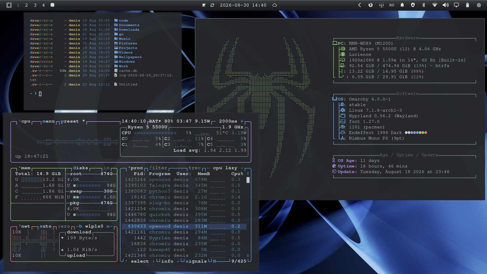

# Omarchy Endeffect 1999 Dark Theme



A dark monochrome gradient theme for Omarchy — black graphite taskbar with beveled hairline, gradient menus, and matching Hyprland borders. Built for Quickshell (Omarchy shell) with a cohesive dark vibe across bar, popups, notifications, and lock screen.

## Installation

```bash
omarchy theme install https://github.com/chupre/omarchy-endeffect1999-theme.git
```

The repository name installs as `endeffect1999`, and Omarchy activates it automatically.

Or manual:

```bash
git clone https://github.com/chupre/omarchy-endeffect1999-theme.git ~/.config/omarchy/themes/endeffect1999
omarchy theme set endeffect1999
```

### Quickshell bar & menu gradient

The gradient taskbar and menu cards require the bundled Quickshell plugins (dark gradient is not a stock Omarchy feature):

```bash
THEME_DIR="$(omarchy theme dir endeffect1999)"
cp -a "$THEME_DIR/plugins/chupre.bar" ~/.config/omarchy/plugins/
cp -a "$THEME_DIR/plugins/chupre.menu" ~/.config/omarchy/plugins/
omarchy-shell shell rescanPlugins
omarchy plugin enable chupre.bar
omarchy plugin enable chupre.menu
omarchy restart shell
```

## Theme Components

- **Shell (Quickshell)**: Gradient bar (`90deg #3a3e44 → #26282c → #1a1c1f`) with top bevel, flat fallback for stock bar; gradient menu/launcher cards via `chupre.menu`; beveled gradient borders on controls/popups
- **Hyprland**: Dark monochrome gradient active border `45deg #4a4e55 → #2a2d31 → #1a1c1f`, inactive `rgba(2a2d31aa)`
- **Neovim / VS Code / Alacritty / Kitty / Ghostty / Foot / Btop / Helix / etc.**: Generated safely by Omarchy from `colors.toml`
- **Backgrounds**: 16 wallpapers (see below)

## Backgrounds

16 wallpapers included in `backgrounds/` — cycle with `omarchy theme bg next`.

## Color Palette

- Background: `#26282c` / Dark `#191b1e` / Darker `#101214` / Lighter `#33363b`
- Foreground: `#c9ccd1` / `#8a8f96` / `#d7dade`
- Accent: `#5f9ad1` (muted, used sparingly; chrome is monochrome)
- Muted: `#7a7f87`
- Reds/Greens/etc.: `#d97b6c`, `#8fbf6f`, `#6fb3bf`, `#6e9fd8` (from `colors.toml`)

## Attribution

Images were taken from https://endeffect.com/1999-2001 by George Smith.

## Repo Structure

```
.
├── colors.toml
├── shell.bar.toml
├── shell.controls.toml
├── shell.hyprland.toml
├── shell.launcher.toml
├── shell.lock.toml
├── shell.menu.toml
├── shell.notifications.toml
├── shell.polkit.toml
├── shell.popups.toml
├── shell.tooltip.toml
├── icons.theme
├── preview.png
├── backgrounds/           # 16 wallpapers
└── plugins/
    ├── chupre.bar/         # gradient taskbar (Shape + LinearGradient, noise.png)
    └── chupre.menu/        # gradient menu/launcher card
```

Based on repo structure from https://github.com/potable-anarchy/omarchy-quake-theme — extended for modern Omarchy shell (`shell.*.toml` + Quickshell plugins vs legacy `waybar.css`).

## Verification

- `omarchy theme list` should show `endeffect-1999-dark` / `endeffect1999`
- `omarchy theme current` → Endeffect
- `hyprctl getoption general:col.active_border` → `ff4a4e55 ff2a2d31 ff1a1c1f 45deg`
- `hyprctl layers | grep omarchy-bar` → mapped bar surface
